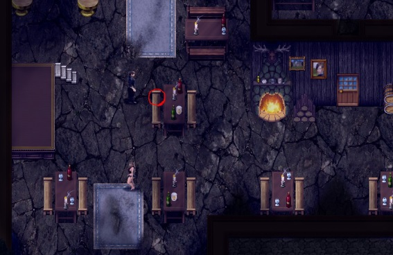
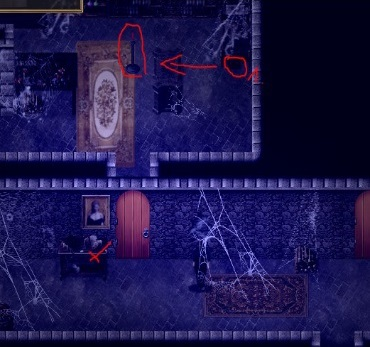

# 序章

1. 从墙上取下你的弓。

2. 走过河，观看卫队长和一名士兵训练。你学会了防御打击（Defensive Strike）。

3. 走进旅馆，和旅店老板谈话，要点喝的。

**可选：Kate 请你帮她找戒指。**

- 如果你自己留着它：+1 堕落值。

- 否则：+1 A（来自 Kate）。

1. 和 Marcus 与 Mira 谈话，之后跟着 Marcus 走进小屋。你可以选择是打断他们，还是躲着不被发现。

2. 离开后 Dave 会出现并揍你一顿。用防御打击（Defensive Strike）反击他。+1 好感度（Mira）。

3. 向北走进森林，走到瞭望台。第一次遇到一头鹿，因为你喝醉了，这次判定总是会失败。

4. 过桥走回家，选择你喜欢什么都行。

5. 先去你的小屋（旅馆左边），然后去 Emily 的房子（在它北边），再去镇长家（过河到东北方向）。

6. 在旅馆里和 Rick 谈话，之后和旅店老板 Thomas 谈话。

7. 

- 从村庄北边进入森林，找到那条隐秘的小路。

8. 向左走，走通往山谷的路。

9. 

- 在小屋里捡起银子，并使用引火石（Fire stones）点亮蜡烛。

10. 从书架上拿 4 本书（直到主角（MC）告诉你他拿够了为止），然后离开小屋。

11. 与女巫的遭遇中，随便选什么都行。如果你选择上了她，这会计入她的堕落值（参见 Gwen）。
