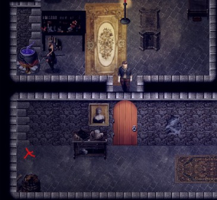

# Lucius（卢修斯）

商店老板。

1. 接到"控制你的欲望"任务后（见 [Mira（米拉）](#wt-mira) 任务 3.），从他的商店购买麻醉剂。

2. 走到女巫的小屋。和她交谈。选择选项 3（即使你并不打算这么做）。

3. 确保（欲望值 < 80）再和她交谈，并问"关于我的处境"— 分散她的注意力。当她起身去找她的药水时，走到她的坩埚前，把麻醉剂放进去（另一种方法：不使用麻醉剂的话，如果你已经完成了 Gwen 的任务，你可以等她离开房间，然后搜索书架）。

4. 
 躲到房间外面。

5. 搜索书架，直到你找到一本关于药水的书（只有当你学会了阅读才能找到这本书，见 Mira。它在左侧，你需要通过一次智力检定）。

6. 和 Lucius 交谈，把书给他。之后他想要一份你的精液样本（使用手淫技能），把它交给他，第二天再回来。

7. 从现在起，你可以在他的商店购买空瓶，并把装满精液的瓶子卖给他，这会提高你的 C（堕落值）（你卖给他的数量会影响其他事件：Kate 的倒酒游戏）。

8. 你可以在他的商店买一件新的皮甲（靠近窗户）。

9. 完成第 7 步 7 天后（如果使用旧存档，时间可能不同），再和他交谈，他会给你一瓶新药水，这瓶药水会在 5-8 天内阻止你的欲望累积，并且防止你在女孩嘴里射精时造成堕落值增加。

10. 右上方的架子上有一把镐，你可以买下来去森林里挖铜矿（需要力量）。

11. 你可以买中间架子上的地图，这样就能快速旅行到你去过的村庄了。（使用 选项 > 按键设置 > 把打开地图绑定到 'M' 或任何你想要的键，也可以通过物品打开地图）
