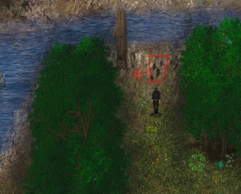
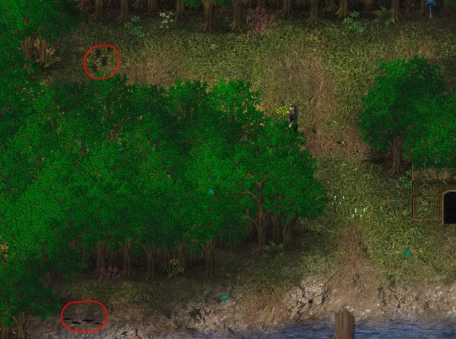

# Emily（艾米莉）

[Mira（米拉）](#wt-mira) 和 [Frisha（弗里莎）](#wt-frisha) 的母亲。

1. 你可以通过给她兔肉来提高她对你的好感度（狩猎：见 [Corven（科尔文）](#wt-corven)，或者晚上在旅馆里买）。

2. 好感度达到 5+ 之后，如果离完成序章已过去 7 天，就在她家睡觉。

3. 两个强盗会来袭击，如果你把两个都杀了（提前攻击），任务不会开始，你只会被派去找他们的营地。

    1. 如果 Emily 被抓住了，你有 7 天时间，要么在老橡树那里付赎金，要么去救她。
        1. **营救她：**
        2. 
 走进黑森林，跟着脚印深入森林深处。检查河边附近的脚印，之后检查那棵树。

        3. 回到 Arenfield 和 Tia（蒂娅）交谈。

        4. 在另一边，走进棚屋，审问那个强盗。

        5. 现在你必须在森林里寻找 3 个符文，位置是随机的，所以去其他地图找找（入口、狩猎场、桥、隐秘小路、森林深处）。

        6. 棚屋床底下你可以找到一个装着金币的箱子。这张地图上有一条通往老橡树的捷径。

        1. 你的钥匙石充满能量后，回到森林深处，检查地图西北边缘的脚印。

        2. 在强盗营地里，你现在可以试着偷偷摸向山洞去救 Emily，如果守卫发现了你，营地就会拉响警报，这会让你到达山洞变得难得多（等到第二天就会恢复正常）。在夜间（20h-6h）会容易得多，因为守卫巡逻的频率比白天低。

        3. 在山洞里你必须杀死那个强盗（没有更好的护甲或武器很难，见 John（约翰）和 Lucius（卢修斯）），并从他的尸体上拿到钥匙。之后在不被发现的情况下逃出营地。

        4. 如果你输掉了战斗，你会失去你的钥匙石，在营地入口附近的森林里会刷新一个新的强盗，你可以从他那里得到一块新的石头。

    2. **付赎金：**
 要得到更多金币，你可以每天和 Mira 交谈，她每天会给你 20 银币。在期限到之前把金币放在老橡树下。

4. 你付了赎金/救出 Emily 之后，现在可以不带食物在她家睡觉了（她会给你一把她家的钥匙）。给她带兔肉仍然会提高她对你的好感度。
 （营救 7 天后：如果你睡在储物间里，强盗会再次袭击）。

5. 好感度达到 11+ 后，晚上在她换睡衣准备睡觉时去她的房间。

6. 继续睡在她床上，直到她开始在你睡着时跟你玩。

7. 晚上在她进卧室之前撞见她（试着偷看 Mira）。

8. 继续和她睡。到了某个时候，她会问你你们俩这是在干什么。选择你是要一段感情还是只是玩玩。如果你已经完成了 Mira 在圣堂里的仪式，Emily 的恋爱选项就不可用了。另一方面，如果你在 Mira 之前走 Emily 的线，并选择和她建立感情，她之后会把这件事告诉 Mira，你们就开始一段双重关系/后宫。

9. 第 8 步之后，如果你已经亲过 Mira，而 Emily 抓到了你，她会问你和她女儿这是在干什么。如果你告诉 Emily，只要你和 Mira 的事情成了你就会离开她，她会结束这段关系（如果你已经开始了的话），但你仍然可以和她玩玩。

10. 如果你 1 天不和她做爱，只是睡在她床上，她会在半夜再次把你叫醒。

11. 要继续 Emily 的故事，你必须把 Mira 的故事推进到她加入教堂的节点。

12. 现在去和 Emily 一起睡，她会请你第二天跟她一起去找 Giron（吉伦）谈谈。

13. 第二天早上，当她在厨房时和她交谈，然后去拜访 Giron。

    3. 在谈话过程中，你有 3 个选项可以继续：
    - 替 Emily 付税（这会给你 30 天）。

    - 如果你在 Arenfield 有正面声望，也可以不用付钱就得到 30 天。

    - 让 Emily 自己处理这件事（可能的 NTR 线）。

14. 从现在起你可以拜访镇长，也替 Emily 付税。你可以在任务日志里看到当前的纳税状态。关于 NTR 线的一个快速提示：
 如果你不替她付税，可以从河边入口进入宅邸，然后溜进 Giron 的书房，或者利用书柜，亲眼目睹她与 Giron 交谈。
 每次 Emily 去见 Giron，情况都会变得更糟。根据任务日志里的信息，她在早上 9am 去见他。如果你在他的房间里等，那会是 10am。
 这件事发生过 3 次以上之后，即使你完成了任务，她也必须永远去见他。当然，如果你禁用了 NTR，这就不会发生 ;) — 这个场景还有一个怀孕变体。

15. 睡觉时再到床上和 Emily 交谈。

16. 和这家人一起吃晚餐。

17. 在教堂和 Francis 神父交谈。

18. 早上在桥边和 Rick（里克）交谈。

19. 和 Emily 交谈，然后收集材料。

20. 你需要大量的木头、钉子（商店）、2 件袍子（商店）、10 个黏土（用水边（河流、湖泊、沼泽）的感知搜索）、20 块石头。你和 Rick 一起搭好脚手架之后就能开采石头了。

21. 和 Rick 交谈开始建造，重复直到他没法继续。

22. 现在你必须先和 Emily 交谈，然后才能建造最后的部分。

23. 要继续，使用脚手架附近的火花标记。

24. 如果你还没清理过，清理 Emily 家里的储物间。你现在可以在这个房间里建造楼梯了。

25. 上到二楼，和 Emily 交谈。

26. 现在去教堂拜访 Francis 神父，和他谈 Emily。

27. 离开教堂，任务完成！

28. 睡觉时和 Emily 交谈。

29. 要为二楼建造家具，去木匠工坊（Roderic（罗德里克）），在他干活时和他交谈。你现在可以为孤儿院买床了。

30. 如果你翻新了主角的房子（升级了他的床），你可以邀请 Emily 来和你一起睡。要这么做，在晚上她收拾完晚餐时和她交谈。如果主角想要做爱，别让自己分心。一旦你邀请了她，你也可以在主角家他的床上触发这个事件。

### 怀孕：

1. 如果在她的房子翻新完成后你内射 Emily，她会在上床睡觉前就此事谈一谈。你现在可以选择为她开启怀孕，或者由她来处理避孕事宜。（如果你选择让她处理，她会时不时地向你要钱）。
 如果开启了怀孕，内射她现在可能让她怀孕（你的欲望值越高，几率越高）。这会开启一个任务，也会向 Frisha 和 Mira 透露这段关系（她们不是应该已经知道了吗）。— 关于如何处理怀孕的决定可以再次更改，如果你和她一起睡并选择拥抱和交谈。

    4. 怀孕期间有 2 个与 Emily 的场景：
    - 在她卧室里睡觉时。

    - 在厨房里：如果 Emily 在厨房达到高潮（等它发生），然后你关闭一次选项菜单（选择射精以外的任何动作），根据房子里有谁，会播放不同的场景。
 NTR：如果 Frisha 正在和 Dave（戴夫）说话（他们必须已经做过爱一次），而你无视他们直接走进厨房，他们会加入。Emily 需要 C15+ 这个选项才可用。

### 婚姻：

1. 如果你之前选择了和 Emily 的感情，那么你有机会娶她。你可以通过和她拥抱来开启相关任务。

2. 这个任务有几个步骤，跟着任务日志走，它会引导你完成。求婚需要去的地方在 Katherin（凯瑟琳）家附近。从 Verena（维雷娜）那里拿西装时，如果你和她已经进展到她会和你做爱的程度，会有她的一段场景。否则你必须付钱给她买西装。那个场景是可重复的，如果你之前付钱拿到了西装，也可以触发。

3. 准备工作完成后，你可以在周日举行婚礼。婚礼结尾的场景是可重复的，和她一起睡觉时选择让 Emily 再穿上那条裙子的选项。

4. 婚礼会引起 Arenfield 其他女人的反应，前提是她们当时在场。这是我将来会进一步改进的地方，也会在与其他女人开始关系时提及。这是一项耗时的任务，有些部分已经实现，有些还没有。比如 Frisha 夜里去拜访 Emily 时的对话已经更新，而她的其他一些场景还没有。

### 堕落值：

1. 每次你在她嘴里射精都会提高它，越来越地改变她的行为。

2. 在 C10 且你 3 天没操她的情况下，你给她带食物之后她会在厨房操你（小场景）。

3. 如果你 5 天没操她，而且睡在储物间里直到深夜，她会过来操你（小场景）。

4. 如果 Emily 的 C 达到 15+，并且你完成了建房，在欲望值超过 50 时到厨房和她交谈。

5. 如果你已经……呃，缺少剧透标签……和她肛交超过 6 次，她也会愿意就在厨房里操你。

### NTR：

1. 她的营救任务失败。

2. 失败太多次，Emily 会和那个强盗做爱（小场景）。

3. 第二次之后：输给看守她的那个强盗。如果 Imawyn（伊玛温）的 C 也到了 10，场景会延长（小场景）。
