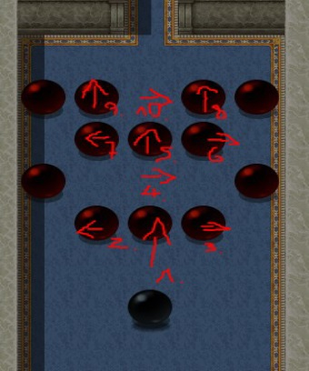

# Gwen（格温）

小屋里的女巫。
[Sabrina](#wt-sabrina)
的主人。

1. 完成序章后，到她的屋子里与她交谈并与她做爱（4 次），直到她的堕落值达到 20（你可以在关系菜单中看到她当前的堕落值）。之后她每天都会失去堕落值。如果降到 0，她就会变回原来的样子。要推进她的任务，你必须始终帮助她保持新形态。

2. 你现在必须学会阅读（见 [Mira](#wt-mira)）。

3. 再次与她交谈，请求成为她的学徒，这将开启任务"一场不洁的狩猎"。

4. 
 进入沼泽并在里面走动，直到主角告诉你必须到洞穴里面搜索。

5. 现在你必须与瘟疫恶魔战斗并获胜（15 级以上），如果遇到困难就带上 Tia。

6. 回到小屋后，你会与 Gwen 进行一段对话。如果幸运的话瘟疫恶魔掉落了心脏，任务就完成了。如果没有，等待 3 天再进入沼泽，新的瘟疫恶魔每 3 天可以刷新一次。杀掉它们直到你得到心脏。然后在大锅旁与 Gwen 交谈（她必须处于新形态）。

7. 现在你必须等待 4 天直到 Sabrina 恢复。通过门进入房间来触发场景。

8. 现在你可以进入 Gwen 的卧室，在她睡着时与她做爱（掀开她的被子）。

    1. 与 Sabrina 交谈开始训练。你每天只能做一次，这会导致你必须完成 3 个谜题。如果卡住了，就离开房间或使用你物品栏里的书（关键物品）：
    2. 

    3. 

    4. 
 要开始第 3 个谜题，你必须先把巫术技能提升到 2（天赋点）。

9. 完成谜题后，当 Gwen 在大锅旁时与她交谈（同样她必须处于年轻形态），并谈论与她结盟。

10. 下一步你将不得不做出决定，要么决定成为 Gwen 的冠军，要么违抗她，后者将导致与她姐姐 Athia 的另一条路线。（如果你决定反对 Gwen，你仍然可以与她做爱，但你不会变得更强大，她仍会把你当宠物对待）——如果你决定违抗她，以下所有步骤都会被跳过。不过你仍然可以通过夜晚在她床边与她交谈（更换位置）和白天在大锅旁与她交谈来观看新场景。

11. 如果你与她结盟，她会要求你为她带来一些仪式材料。你可以从 Arenfield 以东的农田地图上的干草堆里得到稻草。木材必须在森林里收集，布料可以在商店购买。

12. 之后回到 Gwen 那里，她会在她的房间里与你私下交谈。之后你将目睹仪式。

13. 回到 Gwen 身边，再次谈论与她结盟。她现在会与你建立连接。从现在开始，只要你使用她的任何魔法，就会增加她的堕落值。你还会学到新的法术。如果 Gwen 的堕落值达到 100，你将获得一个增益效果，进一步提高你的魔法伤害/防御，并让你对中毒/流血免疫。如果她的堕落值降到 5 以下，她会从你身上吸取能量来恢复部分堕落值。
