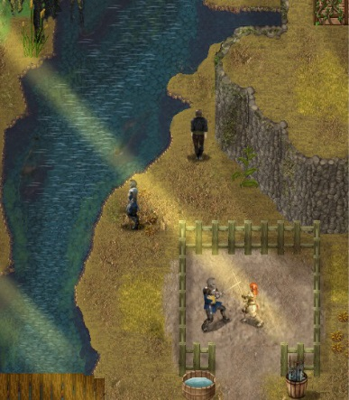

# 市长大宅

1. 要进入其中，你需要用一瓶葡萄酒贿赂 Arenfield 桥边的守卫。

2. 
 沿着河水从宅邸下方流过的路径前进，找到秘密入口。到了那里你需要一把火把才能继续。火把可以在主角的房子里找到。（要么拜访市长并支付 20 金币，要么如果你已经开始了 Bianca 的任务，可以在午夜后用撬锁打开门。）

3. 火把就在主角房子里的一个木桶上，靠近窗户。

4. 到了市长宅邸下方后，你需要用力量或撬锁打开门（别管右边那扇门，即使你现在撬锁它也不会打开）。

5. 进入宅邸前：避免被守卫或宅邸里的人发现。如果你完成了 Emily 的任务，可以选择穿上你仍保留的强盗伪装。这样可以避免被抓时遭受惩罚。但这会让宅邸进入警戒状态。所以被抓之后需要等一天才能一切恢复正常。如果你未伪装就被抓，你在 Arenfield 的名誉会下降。

6. 
 进入市长的图书室或办公室，在书架处找到一扇暗门。你需要至少 1 点感知（Perception）才能发现它（天赋）。屏幕上会弹出你察觉到新鲜空气的提示。然后检查书架进行一次天赋检定。如果你走近书架却没有弹出提示，就需要再次点击书架以获取另一次机会。

7. 找到暗门后，前往地下室。在房间东南角的水桶里可以找到一扇门的钥匙。现在移开门前那个袋子，即可启用这条捷径。床上还有一封信可以读。这会往你的物品栏里添加一张 Yasmine 的画像（可以在关键物品下再次打开）。

8. 上去进入 Giron 的办公室，在书架里你现在也可以使用"留下"的选项。如果身处其中，按回车键或点击它进行互动。

9. 在 Giron 的办公室阅读他桌上的信，以获取关于 Kirlic 男爵的情报。

10. 现在你已经解锁了进行 Frisha 和 Yasmine 内容所需的一切。

11. 在 Lyvia 带领士兵进入森林后，你可以在夜晚撬开前门，以便更快地进入宅邸。

### NTR：

你可以把仆人卧室里的酒瓶换成精酿酒（用葡萄酒瓶+精液瓶制作）。午夜时分，Julia 的堕落值会 +1C，等她这样做了 5 次之后，她会在上床前与 Joseph 发生性关系（**
仅当你在与 Yasmine 的对话中拒绝过她（Julia）的恋爱选项时才会触发**
）。
